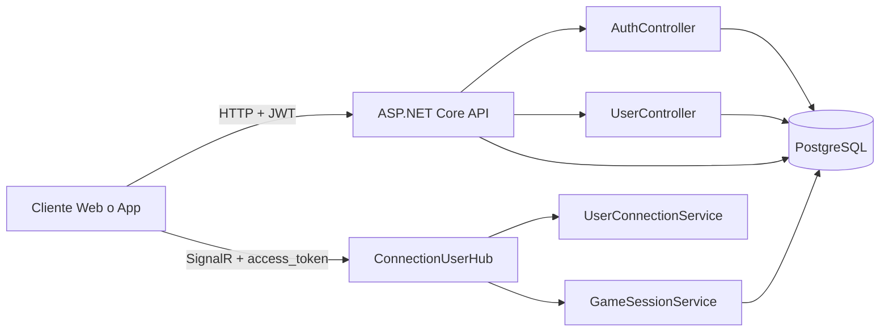

# TicTacToe App SignalR

Backend para un juego de Tic-Tac-Toe multijugador en tiempo real construido con **ASP.NET Core**, **SignalR**, **JWT** y **PostgreSQL**.

El proyecto permite:

- registro e inicio de sesion con usuario y contrasena
- autenticacion con Google
- manejo de presencia de usuarios conectados
- estados de disponibilidad (`Disponible`, `Jugando`, `No molestar`)
- salas privadas entre dos jugadores
- sincronizacion en tiempo real del tablero
- reanudacion y persistencia de partidas
- ranking basado en victorias, empates y derrotas

## Vista General



## Arquitectura

## Estructura del Repositorio

```text
TicTacToe_App_SignalR/
|-- Api/
|   |-- Controllers/
|   |-- Hubs/
|   |-- Properties/
|   `-- Program.cs
|-- Application/
|   |-- Interfaces/
|   `-- Services/
|-- Domain/
|   |-- Dtos/
|   |-- Entities/
|   `-- Enums/
|-- Infrastructure/
|   |-- Helpers/
|   |-- Persistence/
|   |   `-- Migrations/
|   `-- Services/
|-- Dockerfile
`-- TicTacToe_App_SignalR.slnx
```

## Funcionalidades Principales

### 1. Autenticacion

- `POST /api/user/register`: crea un usuario local
- `POST /api/user/login`: devuelve `accessToken` y `refreshToken`
- `POST /api/user/refresh`: renueva credenciales
- `POST /api/auth/google`: login con Google usando `idToken`

La API usa **JWT Bearer** y tambien admite el token por query string para SignalR en:

- `/hubs/connectionuser?access_token=...`

### 2. Presencia y estado de usuarios

Cada usuario puede tener uno de estos estados:

| Id | Estado |
| --- | --- |
| `1` | Disponible |
| `2` | Jugando |
| `3` | No molestar |

Endpoints relacionados:

- `GET /api/user/me/status`
- `PUT /api/user/me/status`
- `GET /api/user/ranking`

### 3. Juego en tiempo real

El hub `ConnectionUserHub` coordina:

- usuarios conectados
- invitaciones a sala privada
- apertura y cierre de salas
- jugadas del tablero
- recuperacion del estado actual
- solicitud de revancha

### 4. Persistencia de partidas

Las partidas se mantienen:

- en memoria para respuesta rapida mientras estan activas
- en PostgreSQL para recuperar estado, historial activo y ranking

Al terminar una partida:

- se marca como inactiva
- se actualizan `Wins`, `Losses`, `Draws` y `GamesPlayed`

## Tecnologias

- `.NET 10`
- `ASP.NET Core Web API`
- `SignalR`
- `Entity Framework Core`
- `PostgreSQL`
- `JWT Bearer Authentication`
- `Swagger / OpenAPI`
- `Docker`

## Requisitos

Antes de ejecutar el proyecto, asegurate de tener:

- `.NET SDK 10`
- `PostgreSQL`
- una base de datos creada para la aplicacion
- opcionalmente, credenciales de Google OAuth para login social

## Configuracion

La aplicacion espera configuracion para:

- cadena de conexion PostgreSQL
- clave JWT
- Client ID de Google

Puedes definirla en `Api/appsettings.Development.json`, variables de entorno o secretos de usuario.

Ejemplo recomendado:

```json
{
  "ConnectionStrings": {
    "PostgresStr": "Host=localhost;Port=5432;Database=tictactoe_db;Username=postgres;Password=tu_password"
  },
  "Jwt": {
    "Key": "una_clave_super_secreta_y_larga"
  },
  "Google": {
    "ClientId": "tu-client-id.apps.googleusercontent.com"
  },
  "Logging": {
    "LogLevel": {
      "Default": "Information",
      "Microsoft.AspNetCore": "Warning"
    }
  }
}
```

## Como Ejecutarlo

### Opcion 1: desde Visual Studio o terminal

1. Restaurar dependencias:

```bash
dotnet restore
```

2. Ejecutar la API:

```bash
dotnet run --project Api/Api.csproj
```

3. Abrir Swagger en desarrollo:

```text
http://localhost:5177/swagger
```

Puertos definidos actualmente en [launchSettings.json](Api/Properties/launchSettings.json):

- `http://localhost:5177`
- `https://localhost:7134`

### Opcion 2: con Docker

Construir imagen:

```bash
docker build -t tictactoe-signalr .
```

Ejecutar contenedor:

```bash
docker run -p 10000:10000 \
  -e ASPNETCORE_ENVIRONMENT=Development \
  -e ConnectionStrings__PostgresStr="Host=host.docker.internal;Port=5432;Database=tictactoe_db;Username=postgres;Password=tu_password" \
  -e Jwt__Key="una_clave_super_secreta_y_larga" \
  -e Google__ClientId="tu-client-id.apps.googleusercontent.com" \
  tictactoe-signalr
```

La imagen expone:

- `http://localhost:10000`

## Migraciones

El proyecto incluye migraciones de Entity Framework Core en:

- `Infrastructure/Persistence/Migrations`

Al iniciar la API, el sistema:

- verifica el estado de migraciones
- crea el historial si detecta una base existente sin `__EFMigrationsHistory`
- ejecuta `Database.Migrate()`

Eso reduce el trabajo manual al levantar el entorno por primera vez.

## Endpoints HTTP

### Auth

| Metodo | Ruta | Descripcion |
| --- | --- | --- |
| `POST` | `/api/auth/google` | Inicia sesion con Google y devuelve tokens |

Body:

```json
{
  "idToken": "token_de_google"
}
```

### User

| Metodo | Ruta | Autorizacion | Descripcion |
| --- | --- | --- | --- |
| `POST` | `/api/user/register` | No | Registro de usuario |
| `POST` | `/api/user/login` | No | Login local |
| `POST` | `/api/user/refresh` | No | Renovacion de tokens |
| `GET` | `/api/user/me/status` | Si | Estado del usuario autenticado |
| `PUT` | `/api/user/me/status` | Si | Cambia disponibilidad |
| `GET` | `/api/user/ranking` | No | Ranking global |

Ejemplo de registro/login:

```json
{
  "username": "jeiso",
  "password": "MiClave123!"
}
```

Ejemplo de refresh:

```json
{
  "accessToken": "jwt_actual",
  "refreshToken": "refresh_actual"
}
```

Ejemplo de cambio de estado:

```json
{
  "statusId": 3
}
```

## Eventos y Metodos de SignalR

Hub:

- `/hubs/connectionuser`

### Metodos que invoca el cliente

| Metodo | Payload | Descripcion |
| --- | --- | --- |
| `AddUserConnectionId` | `string name` | Registra la conexion del usuario autenticado |
| `DisplayOnlineUsers` | - | Publica lista de usuarios conectados |
| `RequestPrivateRoom` | `MessageDto` | Invita a otro usuario a jugar |
| `RejectPrivateRoomRequest` | `MessageDto` | Rechaza una invitacion |
| `CreatePrivateRoom` | `MessageDto` | Crea una sala privada |
| `ClosePrivateRoom` | `MessageDto` | Cierra la sala actual |
| `SendPrivateRoomMessage` | `PrivateMessageDto` | Envia una jugada |
| `GetCurrentGameState` | `string otherUser` | Consulta el estado actual de la partida |
| `SetAvailabilityStatus` | `int statusId` | Cambia el estado del usuario |
| `RequestRematch` | `MessageDto` | Solicita revancha |
| `RespondRematch` | `RematchDecisionDto` | Acepta o rechaza revancha |

### Eventos que recibe el cliente

| Evento | Descripcion |
| --- | --- |
| `UserConnected` | Conexion inicial exitosa |
| `OnlineUsers` | Lista basica de usuarios online |
| `OnlineUsersPresenceUpdated` | Lista de usuarios con presencia y estado |
| `RequestPrivateRoom` | Llega una invitacion |
| `RejectPrivateRoomRequest` | Invitacion rechazada |
| `OpenPrivateRoom` | Apertura de sala privada |
| `ClosePrivateRoom` | Cierre de sala privada |
| `NewPrivateMessage` | Nueva jugada enviada |
| `GameStateUpdated` | Estado actualizado del tablero |
| `GameError` | Error de flujo o de jugada |
| `RematchRequested` | Solicitud de revancha |
| `RematchRejected` | Revancha rechazada |
| `RematchAccepted` | Revancha aceptada |


## Logica del Juego

Cada partida:

- enfrenta a dos jugadores: `PlayerX` y `PlayerO`
- usa un tablero de 9 posiciones
- valida turnos, posiciones y celdas ocupadas
- detecta victoria, empate y revancha
- persiste el estado del tablero, ultimo movimiento y ganador

El ranking se calcula con esta regla:

- victoria = `3` puntos
- empate = `1` punto
- derrota = `0` puntos

El orden del ranking prioriza:

1. puntaje total
2. cantidad de victorias
3. menor numero de derrotas
4. nombre de usuario

### Enlaces

https://tictactoe-app-signalr.onrender.com
https://github.com/corredor29/-TicTacToe_App_SignalR_frontend-
https://tictactoe-app-signalr-frontend.onrender.com

